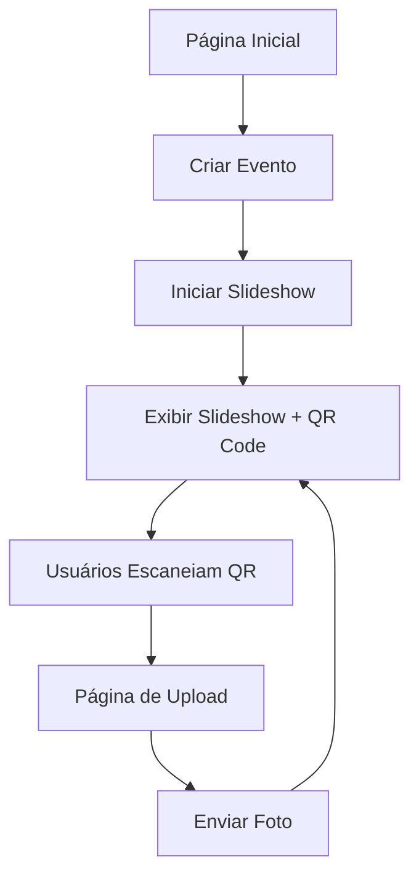

## 1. Visão Geral do Produto
Aplicativo para exibição de slideshow de fotos enviadas por usuários em eventos, com QR code para upload rápido.
- Permite criar evento, iniciar exibição, fazer upload de fotos (escolher ou tirar na hora)
- Hospedagem gratuita, sem custos para o usuário

## 2. Funcionalidades Principais

### 2.1 Papéis de Usuário (se aplicável)
Não há papéis específicos, todos os usuários têm acesso completo às funcionalidades.

### 2.2 Módulo de Funcionalidades
1. **Página inicial**: Criar evento, iniciar exibição, acessar upload
2. **Slideshow**: Exibição fullscreen de fotos em sequência, QR code fixo
3. **Upload de foto**: Selecionar arquivo ou usar câmera, enviar para armazenamento

### 2.3 Detalhes das Páginas
| Nome da Página | Módulo | Descrição da Funcionalidade |
|----------------|--------|------------------------------|
| Página inicial | Formulário de evento | Inserir nome do evento e iniciar slideshow |
| Slideshow | Exibição de fotos | Trocar fotos automaticamente a cada X segundos, exibir QR code |
| Upload | Upload de foto | Selecionar arquivo ou tirar foto com câmera, enviar |

## 3. Processo Principal
1. Usuário acessa a página inicial e cria um evento
2. Usuário inicia o slideshow, que exibe QR code
3. Outros usuários escaneiam QR code para acessar página de upload
4. Usuários fazem upload de fotos, que são adicionadas ao slideshow
5. Slideshow continua exibindo fotos à medida que são enviadas

## 4. Design de Interface do Usuário
### 4.1 Estilo de Design
- Cores principais: Preto e branco minimalista, com acento em laranja vibrante (#FF6B35)
- Estilo de botão: Arredondado, com sombra suave
- Fonte: Inter para legibilidade, Playfair Display para títulos
- Layout: Limpo, com foco nas fotos
- Ícones: Usar lucide-react

### 4.2 Visão Geral do Design das Páginas
| Nome da Página | Módulo | Elementos UI |
|----------------|--------|--------------|
| Página inicial | Formulário | Campo de texto, botão, fundo com textura de grão |
| Slideshow | Exibição | Foto fullscreen, QR code inferior, animação de transição |
| Upload | Upload | Área de drop, botão de câmera, barra de progresso |

### 4.3 Responsividade
Design desktop-first, adaptativo para mobile, otimizado para tela de TV (16:9)

### 4.4 Orientação para Cena 3D (se aplicável)
Não aplicável
