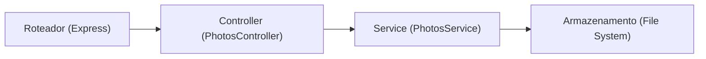

## 1. Projeto de Arquitetura

```mermaid
graph TB
    subgraph Frontend
        A["React + TypeScript + Vite"]
        B["Tailwind CSS"]
        C["Zustand (Estado)"]
        D["QRCode.react"]
    end
    
    subgraph Backend (Express)
        E["API de Upload"]
        F["Serviço de Arquivos"]
    end
    
    subgraph Dados
        G["Armazenamento Local (Arquivos)"]
    end
    
    A --> E
    E --> F
    F --> G
```

## 2. Descrição da Tecnologia
- Frontend: React@18 + TypeScript + Vite + Tailwind CSS + Zustand + QRCode.react
- Backend: Express@4 + TypeScript
- Armazenamento: Arquivos locais (para gratuidade; pode migrar para Supabase Storage posteriormente)
- Hospedagem: Vercel (gratuita)

## 3. Definição de Rotas
| Rota | Propósito |
|------|-----------|
| / | Página inicial (criar evento) |
| /slideshow | Página de slideshow |
| /upload | Página de upload de fotos |
| /api/photos | API para listar/upload de fotos |

## 4. Definições de API
### 4.1 Tipo para Foto
```typescript
interface Photo {
  id: string;
  filename: string;
  url: string;
  createdAt: string;
}
```

### 4.2 Endpoints
- GET /api/photos: Lista todas as fotos
- POST /api/photos: Faz upload de nova foto (multipart/form-data com campo 'file')
- DELETE /api/photos/:id: Exclui foto (opcional)

## 5. Diagrama de Arquitetura do Servidor


## 6. Modelo de Dados
Armazenamento em arquivos, sem banco de dados relacional (simples para gratuidade)
